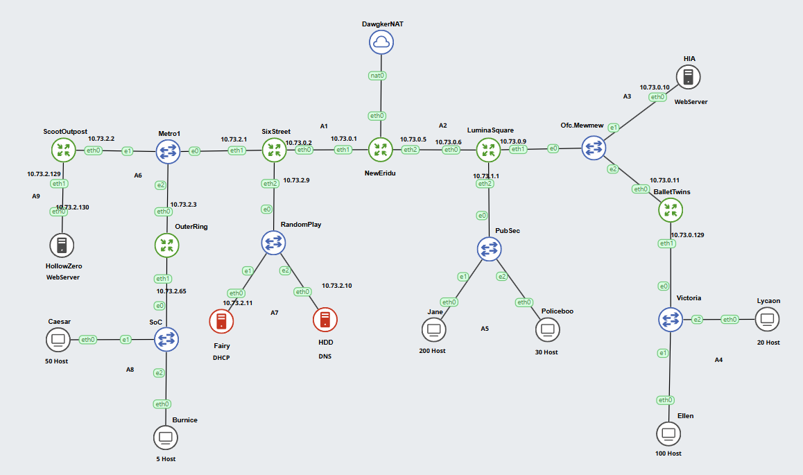

# Modul 5 Jarkom

## **Topologi**



**NewEridu**

```
auto eth0
iface eth0 inet dhcp

auto eth1
iface eth1 inet static
  address 10.73.0.1
  netmask 255.255.255.252

auto eth2
iface eth2 inet static
  address 10.73.0.5
  netmask 255.255.255.252

#A6
post-up route add -net 10.73.2.0 netmask 255.255.255.248 gw 10.73.0.2

#A3
post-up route add -net 10.73.0.8 netmask 255.255.255.248 gw 10.73.06

#A8
post-up route add -net 10.73.2.64 netmask 255.255.255.192 gw 10.73.0.2

#A7
post-up route add -net 10.73.2.8 netmask 255.255.255.248 gw 10.73.0.2

#A4
post-up route add -net 10.73.0.128 netmask 255.255.255.128 gw 10.73.0.6

#A5
post-up route add -net 10.73.1.0 netmask 255.255.255.0 gw 10.73.0.6

#A9
post-up route add -net 10.73.2.128 netmask 255.255.255.252 gw 10.73.0.2

```

**SixStreet (DHCP Relay)**

```
auto eth0
iface eth0 inet static
  address 10.73.0.2
  netmask 255.255.255.252
  gateway 10.73.0.1

auto eth1
iface eth1 inet static
  address 10.73.2.1
  netmask 255.255.255.248

auto eth2
iface eth2 inet static
  address 10.73.2.9
  netmask 255.255.255.248

up echo nameserver 192.168.122.1 > /etc/resolv.conf

#A8
post-up route add -net 10.73.2.64 netmask 255.255.255.192 gw 10.73.2.3

#A9
post-up route add -net 10.73.2.128 netmask 255.255.255.252 gw 10.73.2.2

#A4
post-up route add -net 10.73.0.128 netmask 255.255.255.128 gw 10.73.0.1

```

**HDD (DNS)**

```
auto eth0
iface eth0 inet static
  address 10.73.2.10
  netmask 255.255.255.248
  gateway 10.73.2.9

up echo nameserver 192.168.122.1 > /etc/resolv.conf

```

**Fairy (DHCP)**

```
auto eth0
iface eth0 inet static
  address 10.73.2.11
  netmask 255.255.255.248
  gateway 10.73.2.9

up echo nameserver 192.168.122.1 > /etc/resolv.conf

#A8
post-up route add -net 10.73.2.16 netmask 255.255.255.192 gw 10.73.2.9

#A4
post-up route add -net 10.73.0.128 netmask 255.255.255.128 gw 10.73.2.9

```

**OuterRing (DHCP Relay)**

```
auto eth0
iface eth0 inet static
  address 10.73.2.3
  netmask 255.255.255.248
  gateway 10.73.2.1

auto eth1
iface eth1 inet static
  address 10.73.2.65
  netmask 255.255.255.192

up echo nameserver 192.168.122.1 > /etc/resolv.conf

#A9
post-up route add -net 10.73.2.128 netmask 255.255.255.252 gw 10.73.2.2

#A1
post-up route add -net 10.73.0.0 netmask 255.255.255.252 gw 10.73.2.1

#A7
post-up route add -net 10.73.2.8 netmask 255.255.255.248 gw 10.73.2.1

```

**Burnice (Client)**

```
auto eth0
iface eth0 inet dhcp

#Hollowzero
post-up route add -net 10.73.2.128 netmask 255.255.255.252 gw 10.73.2.65

#A1
post-up route add -net 10.73.0.0 netmask 255.255.255.252 gw 10.73.2.65

```

**Caesar (Client)**

```
auto eth0
iface eth0 inet dhcp

#Hollowzero
post-up route add -net 10.73.2.128 netmask 255.255.255.252 gw 10.73.2.65

#A1
post-up route add -net 10.73.0.0 netmask 255.255.255.252 gw 10.73.2.65

```

**LuminaSquare (DCHP Relay)**

```
auto eth0
iface eth0 inet static
  address 10.73.0.6
  netmask 255.255.255.252
  gateway 10.73.0.5

auto eth1
iface eth1 inet static
  address 10.73.0.9
  netmask 255.255.255.248

auto eth2
iface eth2 inet static
  address 10.73.1.1
  netmask 255.255.255.0

up echo nameserver 192.168.122.1 > /etc/resolv.conf

#A1
post-up route add -net 10.73.0.0 netmask 255.255.255.252 gw 10.73.0.5

#A4
post-up route add -net 10.73.0.128 netmask 255.255.255.128 gw 10.73.0.11

#A7
post-up route add -net 10.73.2.8 netmask 255.255.255.248 gw 10.73.0.5

```

**Jane (Client)**

```
auto eth0
iface eth0 inet dhcp

```

**Policeboo (Client)**

```
auto eth0
iface eth0 inet dhcp

```

**HIA (Web Server)**

```
auto eth0
iface eth0 inet static
  address 10.73.0.10
  netmask 255.255.255.248
  gateway 10.73.0.9

up echo nameserver 192.168.122.1 > /etc/resolv.conf

```

**HollowZero (Web Server)**

```
auto eth0
iface eth0 inet static
  address 10.73.2.130
  netmask 255.255.255.252
  gateway 10.73.2.129

up echo nameserver 192.168.122.1 > /etc/resolv.conf

#A1
post-up route add -net 10.73.0.0 netmask 255.255.255.252 gw 10.73.2.129

```

**BalletTwins (DHCP Relay)**

```
auto eth0
iface eth0 inet static
  address 10.73.0.11
  netmask 255.255.255.248
  gateway 10.73.0.9

auto eth1
iface eth1 inet static
  address 10.73.0.129
  netmask 255.255.255.128

up echo nameserver 192.168.122.1 > /etc/resolv.conf

#A2
post-up route add -net 10.73.0.4 netmask 255.255.255.252 gw 10.73.0.9

#A1
post-up route add -net 10.73.0.0 netmask 255.255.255.252 gw 10.73.0.9

#A7
post-up  route add -net 10.73.2.8 netmask 255.255.255.248 gw 10.73.0.9

```

**Ellen (Client)**

```
auto eth0
iface eth0 inet dhcp
```

**Lycaon (Client)**

```
auto eth0
iface eth0 inet dhcp
```

**ScootOutpost**

```jsx
auto eth0
iface eth0 inet static
  address 10.73.2.2
  netmask 255.255.255.248
  gateway 10.73.2.1

auto eth1
iface eth1 inet static
  address 10.73.2.129
  netmask 255.255.255.252

up echo nameserver 192.168.122.1 > /etc/resolv.conf

#A2
post-up route add -net 10.73.0.4 netmask 255.255.255.252 gw 10.73.2.1

#A8
post-up route add -net 10.73.2.16 netmask 255.255.255.192 gw 10.73.2.3

#A1
post-up  route add -net 10.73.0.0 netmask 255.255.255.252 gw 10.73.2.1
```

## MISI 1

### NO 4
DHCP Relay (OuterRing, SixStreet, LuminaSquare, BalletTwins):
```
apt-get update
apt-get install isc-dhcp-relay -y
service isc-dhcp-relay start

echo 'SERVERS="10.73.2.11"
INTERFACES="eth0 eth1 eth2 eth3"
OPTIONS=' > /etc/default/isc-dhcp-relay

service isc-dhcp-relay restart
```

DHCP Server (Fairy):
```
apt-get update
apt-get install isc-dhcp-server -y
service isc-dhcp-server start

echo 'INTERFACESv4="eth0"' > /etc/default/isc-dhcp-server

# A4
echo 'subnet 10.73.0.128 netmask 255.255.255.128 {
        range 10.73.0.129 10.73.0.254;
        option routers 10.73.0.129;
        option broadcast-address 10.73.0.255;
        option domain-name-servers 10.73.2.10; #IP DNS Server
}
# A5
subnet 10.73.1.0 netmask 255.255.255.0 {
        range 10.73.1.1 10.66.1.254;
        option routers 10.73.1.1;
        option broadcast-address 10.73.1.255;
        option domain-name-servers 10.73.2.10; #IP DNS Server
}
# A8
subnet 10.73.2.64 netmask 255.255.255.192 {
        range 10.73.2.65 10.73.2.126;
        option routers 10.73.2.65;
        option broadcast-address 10.73.2.127;
        option domain-name-servers 10.73.2.10; #IP DNS Server
}
#A7
subnet 10.73.2.8 netmask 255.255.255.248 {}'>/etc/dhcp/dhcpd.conf
```

DNS Server HDD:
```
apt-get update
apt-get install bind9 -y

echo 'options {
        directory "/var/cache/bind";

        forwarders {
            192.168.122.1;
        };

        allow-query{any;};

        auth-nxdomain no;    # conform to RFC1035
        listen-on-v6 { any; };
};' > /etc/bind/named.conf.options

service bind9 restart
```

Webserver:
```
apt-get update
apt-get install apache2 -y

HOST=$(hostname)
echo "Welcome to $HOST" > /var/www/html/index.html

service apache2 restart
```

## MISI 2

### NO 1
1. Jalankan script berikut pada NewEridu
   ```
   ETH0_IP=$(ip -4 addr show eth0 | grep -oP '(?<=inet\s)\d+(\.\d+){3}')
   iptables -t nat -A POSTROUTING -o eth0 -j SNAT --to-source $ETH0_IP
   ```
2. Ping google.com untuk mengecek
   


### NO 2
1. Awalnya HIA dan fairy saling bisa ping
   
   
2. Jalankan command berikut agar tidak ada perangkat yang bisa ping fairy
   ```
   iptables -A INPUT -p icmp --icmp-type echo-request -j DROP
   ```
   
4. Fairy bisa ping HIA tetapi HIA tidak bisa ping fairy
   
   


### NO 3 
1. Jalankan command ini pada DHCP server HDD agar hanya Fairy yang dapat mengakses HDD
   ```
   iptables -A INPUT -s 10.73.2.11 -j ACCEPT
   iptables -A INPUT -j DROP
   ```
   
2. Fairy bisa ping HDD namun perangkat lain tidak bisa
   
   
4. Saat ditest menggunakan nc dari fairy
   
   
5. Saat ditest menggunakan nc dari ballettwins
   
   
6. Hapus aturan menggunakan command
   ```
   iptables -L INPUT -n --line-numbers
   iptables -D INPUT (nomor aturan)
   ```

### NO 4
1. Jalankan command ini pada webserver HollowZero
   ```
   iptables -A INPUT -s 10.73.2.64/26 -m time --weekdays Mon,Tue,Wed,Thu,Fri -j ACCEPT
   iptables -A INPUT -s 10.73.1.0/24 -m time --weekdays Mon,Tue,Wed,Thu,Fri -j ACCEPT
   iptables -A INPUT -j REJECT
   ```
   

2. Testing pada client Jane
   
3. Testing pada client selain Burnice, Caesar, Jane, dan Policeboo
   

### NO 5
1. Jalankan command ini pada webserver HIA
   ```
   iptables -A INPUT -s 10.73.0.128/25 -m time --timestart 08:00 --timestop 21:00 -j ACCEPT
   iptables -A INPUT -s 10.73.1.0/24 -m time --timestart 03:00 --timestop 23:00 -j ACCEPT
   iptables -A INPUT -j REJECT
   ```
   
2. Testing pada client Ellen
   Bukan jam akses
   
   Pada jam akses
   
4. Testing pada client Jane
   Pada jam akses
   
   Bukan jam akses
   
6. Testing pada client selain faksi Victoria (Ellen & Lycaon) & PubSec (Jane & Policeboo)
   

### NO 6
1. Jalankan script ini pada HIA
   ```
    # Create a chain for handling port scanning
    iptables -N PORTSCAN
    
    # Detect and handle new connections to ports 1-100
    iptables -A INPUT -p tcp --dport 1:100 -m state --state NEW -m recent --set --name portscan
    iptables -A INPUT -p tcp --dport 1:100 -m state --state NEW -m recent --update --seconds 10 --hitcount 25 --name portscan -j PORTSCAN
    
    # Log and block port-scanning IPs
    iptables -A PORTSCAN -m recent --set --name blacklist
    iptables -I PORTSCAN 1 -j LOG --log-prefix "PORT SCAN DETECTED: " --log-level 7
    iptables -A PORTSCAN -j DROP
    
    # Block all further traffic from blacklisted IPs
    iptables -A INPUT -m recent --name blacklist --rcheck -j DROP
    iptables -A OUTPUT -m recent --name blacklist --rcheck -j DROP
   ```
2. Masih bisa diping dan dicurl di awal
   
3. Coba lakukan nmap
   
4. Ketika coba diping dan dicurl setelah melakukan nmap tidak bisa
   

### NO 7
1. Jalankan command berikut pada HollowZero
   ```
   iptables -A INPUT -p tcp --dport 80 -m conntrack --ctstate NEW -m recent --set --name HollowZero
   iptables -A INPUT -p tcp --dport 80 -m conntrack --ctstate NEW -m recent --rcheck --seconds 60 --hitcount 3 --name HollowZero -j REJECT
   iptables -A INPUT -p tcp --dport 80 -j ACCEPT
   ```
2. Install parallel
   ```
   apt update
   apt install parallel -y
   ```
3. Jalankan command ini untuk curl di Burnice, Caeser, Jane dan Policeboo secara bersamaan
   ```
   parallel curl -s 10.73.2.130 ::: 10.73.2.68 10.73.2.67 10.73.1.3 10.73.1.2
   ```
   

### NO 8
1. Jalankan script berikut di Burnice agar paket yang diterima ke burnice akan dialihkan ke HollowZero.
  ```
  iptables -t nat -A PREROUTING -p tcp --dport 1234 -s 10.73.2.11 -d 10.73.2.69 -j DNAT --to-destination 10.73.2.130:1234
  iptables -t nat -A POSTROUTING -p tcp --dport 1234 -d 10.73.2.130 -j MASQUERADE
  ```
2. Listen nc pada port 1234
   
3. Kirim pesan ke ip burnice melalui port 1234
   
4. Pesan akan diterima oleh Hollowzero
   


## MISI 3

### NO 1
1. Sebelum Burnice terisolasi, kirim message “Kepercayaan adalah dasar dari jaringan yang aman. Jangan pernah mengkhianatinya.” dari Fairy ke Burnice
   
   
2. Jalankan command berikut untuk memblokir 


   


   


   


